# AI-103 — Day 6: RAG & Grounding (Chi tiết từng bước từ Set Index đến Generation)

> **Mục tiêu:** Nắm vững toàn bộ quy trình xây dựng hệ thống **RAG hoàn chỉnh chuẩn Enterprise**: từ chuẩn bị dữ liệu, chia đoạn (Chunking), tạo Vector Embeddings, **tự tạo và cấu hình Azure AI Search Index từng bước bằng Python SDK**, đến 3 phương pháp tích hợp RAG (Custom Code-first, Azure OpenAI "On Your Data", và Foundry Agent Tool).

**Thời lượng gợi ý:** 3–4 giờ.  
**Chi phí mục tiêu:** **$0.00–$0.05** (Dùng Search Service Free Tier `F1` từ Day 5 kết hợp model `ai103-chat-mini` đã deploy từ Day 3; không bật Semantic Ranker trả phí).  
**Phạm vi lab:** `rg-ai103-lab` → Azure AI Search Service (`F1`) + Azure OpenAI (`ai103-chat-mini`).

---

## Lab checkpoint — 19/09/2026

### Những gì đã hoàn thành

- [x] Tạo Azure AI Search service `ai103-search-index` trong `rg-ai103-lab`.
- [x] Chọn `Central US`, tier **Free (F1)**, 1 replica, 1 partition và chi phí hiển thị `$0.00`.
- [x] Ghi nhận endpoint: `https://ai103-search-index.search.windows.net`.
- [x] Giữ API access control ở chế độ **Both**, cho phép API key và Microsoft Entra ID/RBAC cùng hoạt động.
- [x] Cấp cho tài khoản `Le Quang Nhat (Guest)` tại đúng scope search service hai role:
  - `Search Service Contributor`: tạo và quản lý search objects, gồm index.
  - `Search Index Data Contributor`: upload và query document data.
- [x] Deploy embedding model `text-embedding-3-small`. Deployment name cũng là `text-embedding-3-small` và sẽ được dùng nguyên văn trong code.
- [x] Chạy preflight keyless thành công với `DefaultAzureCredential`; service đang có `0 / 3` indexes theo quota F1.

### Việc tiếp theo

- [ ] Chạy `uv run python labs/day-6/search_index.py --create-index` để tạo schema rỗng `ai103-rag-index`.
- [ ] Sinh embeddings và upload ba document chunks mẫu.
- [ ] Chạy hybrid retrieval, đóng gói citations, rồi tạo grounded answer.

### Lệnh kiểm tra đã dùng

```bash
az account show
uv run python labs/day-6/search_index.py
```

Kết quả xác nhận: subscription `Azure AI-103 Learning`, account `lqnhat136@gmail.com`, và `Keyless Azure AI Search access: OK`.

### Bằng chứng thao tác trên Azure Portal

#### 1. Tạo Search service Free tier

Resource group trước khi tạo Search service:

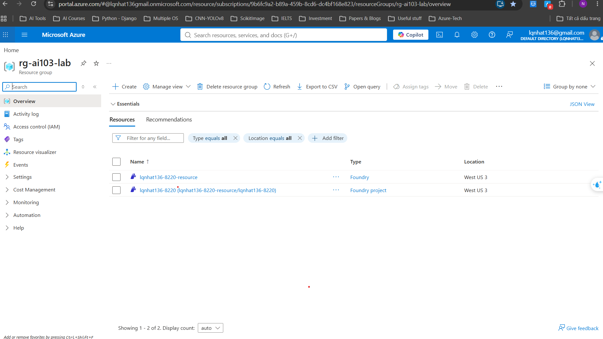

Chọn Azure AI Search trong Marketplace:

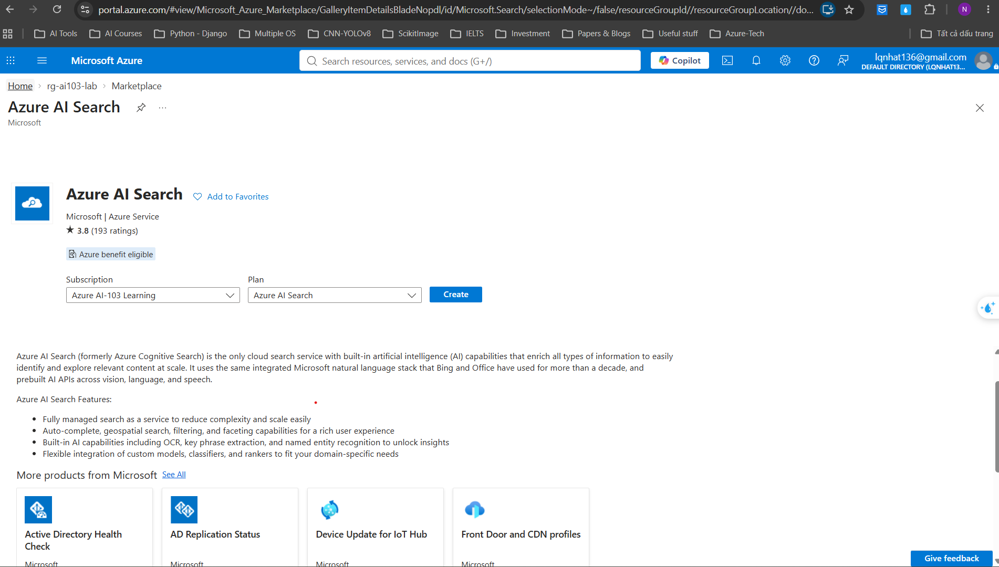

Điền cấu hình cơ bản cho search service:

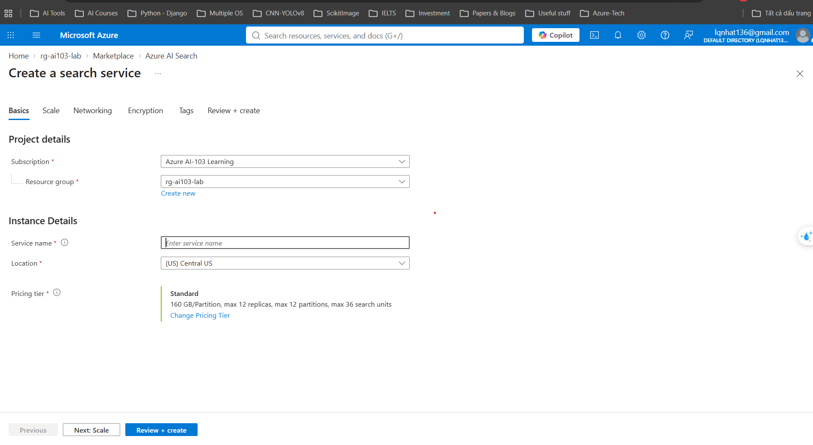

Chọn pricing tier Free:

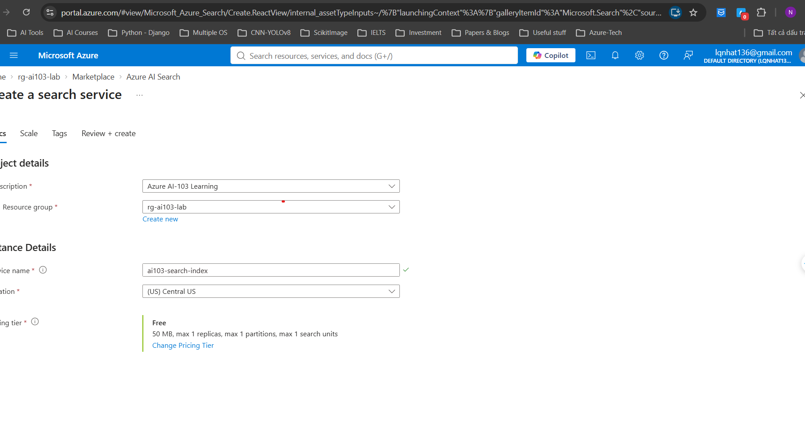

Xác nhận Scale cố định 1 replica, 1 partition và `$0.00`:

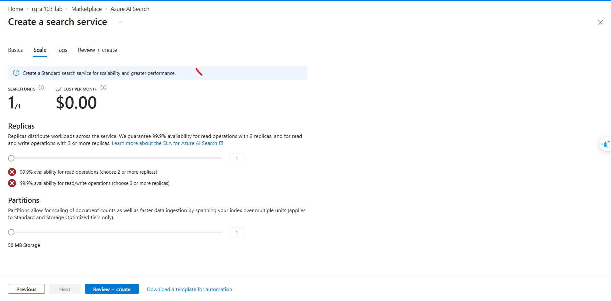

Review trước khi tạo resource:

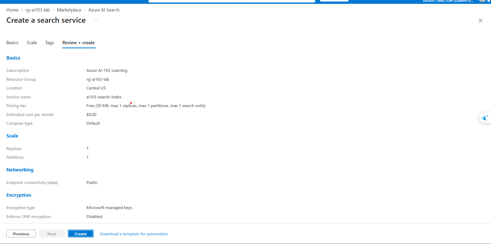

Search service đã Running, có endpoint và Free tier:

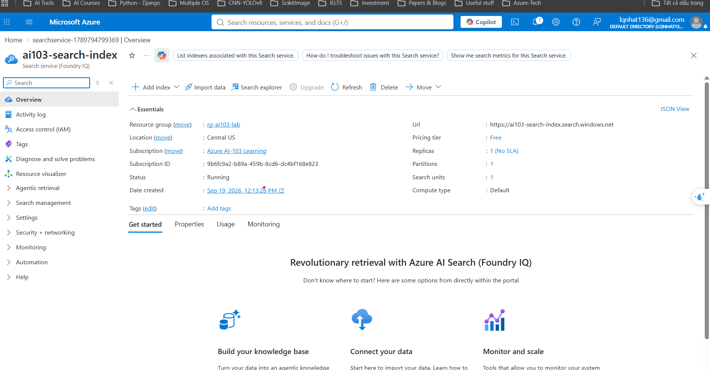

#### 2. Cấu hình access control keyless

Điều hướng trong Settings để tìm trang Keys:

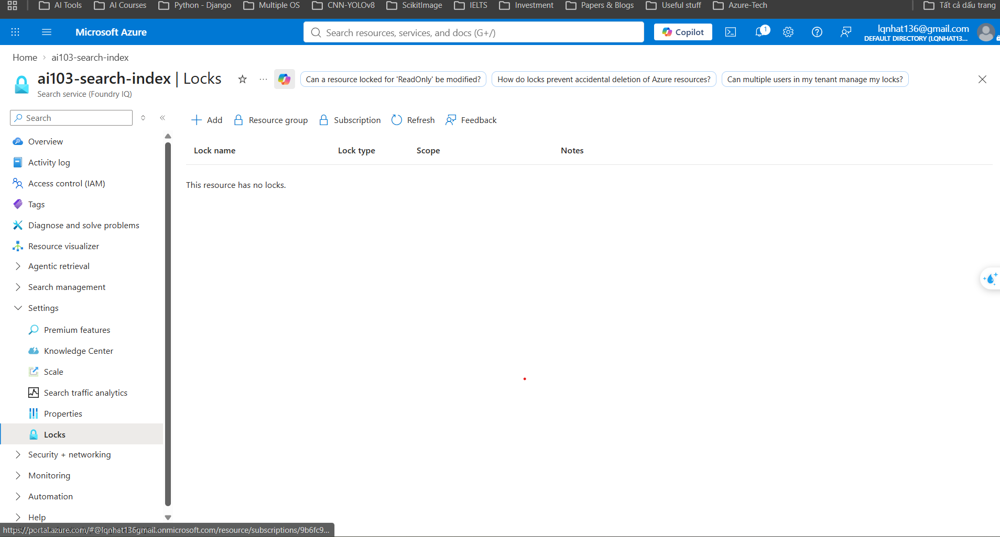

Trang Keys xác nhận API access control đang để `Both`; không copy hoặc regenerate admin key cho lab:

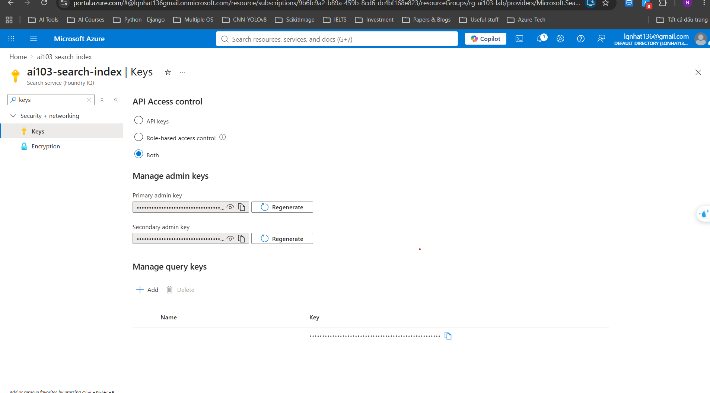

Chọn role `Search Service Contributor`:

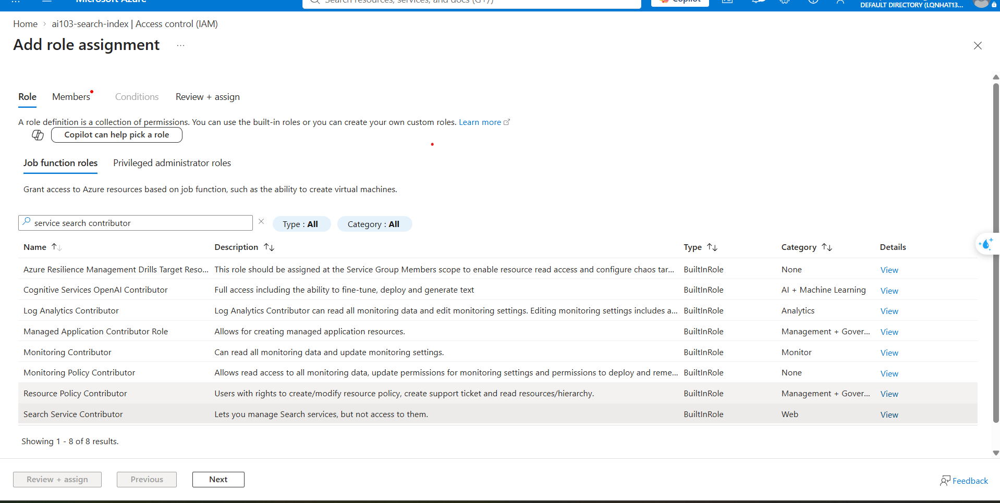

Chọn member `Le Quang Nhat (Guest)` cho role quản lý search objects:

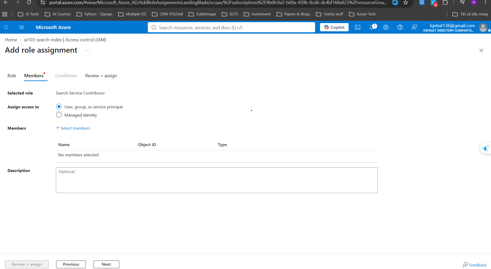

Review role `Search Service Contributor` tại đúng resource scope:

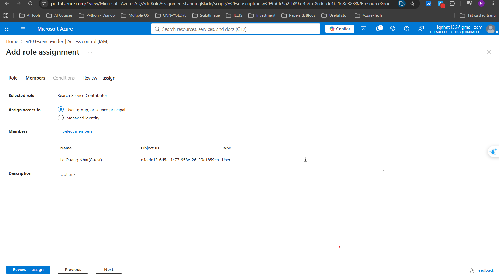

Chọn cùng member cho role data-plane:


Review role `Search Index Data Contributor` tại đúng resource scope:

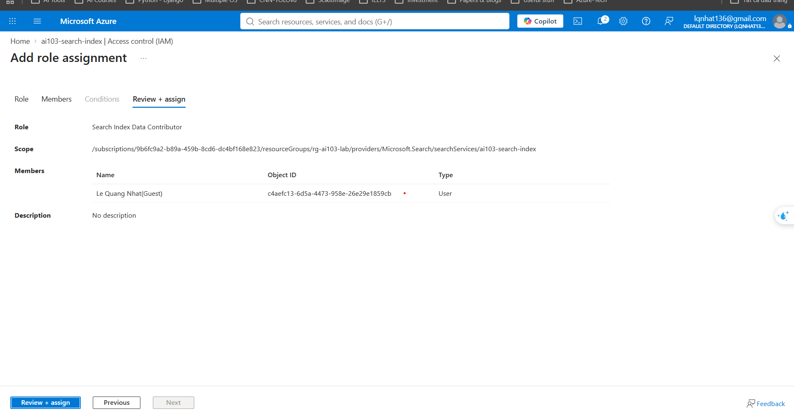

---

## 1. Mental Model: Kiến trúc RAG Chuẩn Enterprise

Trong đề thi AI-103, hệ thống RAG không chỉ đơn giản là "nhét dữ liệu vào prompt", mà là một chu trình 2 giai đoạn: **Indexing Phase** (chuẩn bị kho tri thức) và **Inference Phase** (truy xuất và sinh câu trả lời có kiểm chứng).

```text
┌─────────────────────────────────────────────────────────────────────────────────────────┐
│ GIAI ĐOẠN 1: INDEXING PIPELINE (Chuẩn bị Index)                                         │
│                                                                                         │
│  [Raw Documents]                                                                        │
│         │                                                                               │
│         ▼ (Step 1: Chunking)                                                            │
│  [Text Chunks] ──(Step 2: Embedding Model)──► [Vector 1536d]                            │
│         │                                             │                                 │
│         └──────────────────────┬──────────────────────┘                                 │
│                                ▼ (Step 3 & 4: Upload)                                   │
│                 ┌──────────────────────────────────────┐                                │
│                 │      Azure AI Search Index           │                                │
│                 │  • Inverted Index (BM25 Text)        │                                │
│                 │  • Vector Index (HNSW Graph)         │                                │
│                 │  • Semantic Config (Semantic Ranker) │                                │
│                 └──────────────────────────────────────┘                                │
└────────────────────────────────────────────┬────────────────────────────────────────────┘
                                             │
┌────────────────────────────────────────────┼────────────────────────────────────────────┐
│ GIAI ĐOẠN 2: INFERENCE & GROUNDING         ▼                                            │
│                                                                                         │
│  [User Query] ──► Hybrid Search (Keyword + Vector) ──► Top Chunks + Citations           │
│                                                              │                          │
│                                                              ▼                          │
│                                      ┌───────────────────────────────┐                  │
│                                      │ Grounded Prompt Context       │                  │
│                                      │ • Strictness Control          │                  │
│                                      │ • Citation Markers [1], [2]   │                  │
│                                      └───────────────┬───────────────┘                  │
│                                                      ▼                                  │
│                                            [Azure OpenAI Model]                         │
│                                                      │                                  │
│                                                      ▼                                  │
│                                  [Grounded Answer with Source Links]                    │
└─────────────────────────────────────────────────────────────────────────────────────────┘
```

---

## 2. Hướng dẫn Từng bước: Khởi tạo và Cấu hình Search Index (Step-by-Step)

Để hệ thống RAG hoạt động, ta phải định nghĩa một **Search Index** có đầy đủ cả 3 năng lực: **Text Search (BM25)**, **Vector Search (HNSW)**, và **Semantic Configuration**.

### Bước 1: Chuẩn bị Dữ liệu mẫu & Chiến lược Chunking

Đề thi AI-103 nhấn mạnh: **Chất lượng RAG phụ thuộc 80% vào chất lượng Chunking**.
- **Chunk Size:** 300–500 tokens (vừa vặn ngữ cảnh một điều khoản chính sách).
- **Chunk Overlap:** 10–15% (50 tokens để không đứt đoạn câu hay thực thể).
- **Metadata đi kèm:** Luôn lưu `parent_id` (tên file nguồn), `title` (tiêu đề đoạn), và `category` (phân loại phòng ban).

```python
# Ví dụ cấu trúc 1 Document Chunk chuẩn bị nạp vào Index
sample_chunk = {
    "chunk_id": "doc1-chunk-01",
    "parent_id": "azure-cost-policy.pdf",
    "title": "Chính sách Ngân sách và Hạn ngạch Azure",
    "category": "Cloud Governance",
    "content": "Azure Quota là giới hạn số lượng tài nguyên tối đa có thể tạo trong subscription. Azure Budget cho phép đặt ngưỡng chi tiêu hàng tháng (ví dụ $100) và tự động gửi email cảnh báo khi đạt 80% hoặc 100%.",
    # Mảng vector 1536 chiều được sinh từ Azure OpenAI text-embedding-3-small
    "content_vector": [0.0142, -0.0521, 0.0894, ..., 0.0031]
}
```

---

### Bước 2: Định nghĩa Schema Index bằng Python SDK (`SearchIndexClient`)

Đây là phần mã nguồn quan trọng nhất mà thí sinh thường bối rối trong kỳ thi thực hành. Sử dụng thư viện `azure-search-documents`:

```python
from azure.identity import DefaultAzureCredential
from azure.search.documents.indexes import SearchIndexClient
from azure.search.documents.indexes.models import (
    SearchIndex,
    SimpleField,
    SearchableField,
    SearchField,
    SearchFieldDataType,
    VectorSearch,
    HnswAlgorithmConfiguration,
    VectorSearchProfile,
    SemanticConfiguration,
    SemanticSearch,
    SemanticPrioritizedFields,
    SemanticField,
)

SEARCH_ENDPOINT = "https://<your-search-service>.search.windows.net"
INDEX_NAME = "ai103-rag-index"

credential = DefaultAzureCredential()
index_client = SearchIndexClient(endpoint=SEARCH_ENDPOINT, credential=credential)

# 1. Định nghĩa các trường (Fields)
fields = [
    # Trường khóa chính (bắt buộc)
    SimpleField(name="chunk_id", type=SearchFieldDataType.String, key=True),
    
    # Metadata lọc và hiển thị
    SimpleField(name="parent_id", type=SearchFieldDataType.String, filterable=True, retrievable=True),
    SearchableField(name="title", type=SearchFieldDataType.String, searchable=True, retrievable=True),
    SimpleField(name="category", type=SearchFieldDataType.String, filterable=True, facetable=True),
    
    # Nội dung văn bản phục vụ BM25 và đọc ngữ cảnh
    SearchableField(name="content", type=SearchFieldDataType.String, searchable=True, retrievable=True),
    
    # Trường Vector 1536 chiều (cho text-embedding-3-small)
    SearchField(
        name="content_vector",
        type=SearchFieldDataType.collection(SearchFieldDataType.Single),
        searchable=True,
        vector_search_dimensions=1536,
        vector_search_profile_name="my-hnsw-profile"
    )
]

# 2. Cấu hình Vector Search (HNSW Algorithm)
vector_search = VectorSearch(
    algorithms=[
        HnswAlgorithmConfiguration(
            name="my-hnsw-algo",
            parameters={
                "m": 4,                  # Số liên kết 2 chiều trên mỗi node đồ thị
                "efConstruction": 400,    # Kích thước danh sách ứng viên khi xây dựng index
                "efSearch": 500,          # Kích thước danh sách ứng viên khi truy vấn
                "metric": "cosine"       # Khoảng cách so khớp: cosine, dotProduct, euclidean
            }
        )
    ],
    profiles=[
        VectorSearchProfile(
            name="my-hnsw-profile",
            algorithm_configuration_name="my-hnsw-algo"
        )
    ]
)

# 3. Cấu hình Semantic Search (Semantic Ranker L2)
semantic_config = SemanticConfiguration(
    name="my-semantic-config",
    prioritized_fields=SemanticPrioritizedFields(
        title_field=SemanticField(field_name="title"),
        content_fields=[SemanticField(field_name="content")],
        keywords_fields=[SemanticField(field_name="category")]
    )
)
semantic_search = SemanticSearch(configurations=[semantic_config])

# 4. Gom lại và tạo Index trên Azure
index = SearchIndex(
    name=INDEX_NAME,
    fields=fields,
    vector_search=vector_search,
    semantic_search=semantic_search
)

index_client.create_or_update_index(index)
print(f" Đã khởi tạo Search Index '{INDEX_NAME}' thành công!")
```

---

### Bước 3: Nạp Dữ liệu (Upload Documents) vào Index

Sử dụng `SearchClient` để tải các chunks kèm vector lên Index:

```python
from azure.search.documents import SearchClient

search_client = SearchClient(endpoint=SEARCH_ENDPOINT, index_name=INDEX_NAME, credential=credential)

# Nạp một danh sách tài liệu mẫu (Batch Upload)
documents_to_upload = [
    {
        "chunk_id": "policy-001",
        "parent_id": "azure-cost-rules.pdf",
        "title": "Quy định Hạn mức Chi tiêu Azure",
        "category": "Finance",
        "content": "Nhóm tài nguyên rg-ai103-lab được cấp ngân sách $10/tháng. Khi chi tiêu vượt 80%, Azure Cost Management sẽ kích hoạt email alert gửi cho DevOps Lead.",
        # Vector giả lập hoặc sinh từ embedding model (1536 số thực)
        "content_vector": [0.01] * 1536
    },
    {
        "chunk_id": "policy-002",
        "parent_id": "azure-security-rules.pdf",
        "title": "Chính sách Xác thực Không dùng Khóa (Keyless)",
        "category": "Security",
        "content": "Mọi ứng dụng kết nối Azure AI Services bắt buộc dùng Managed Identity hoặc DefaultAzureCredential. Tuyệt đối không lưu API Key tĩnh trong mã nguồn.",
        "content_vector": [0.02] * 1536
    }
]

result = search_client.upload_documents(documents=documents_to_upload)
print(f" Đã nạp thành công {len(result)} tài liệu vào Index.")
```

---

## 3. Hướng dẫn Thao tác trên Giao diện Web (Azure Portal & Foundry Studio UI)

Trong kỳ thi AI-103 và triển khai thực tế, bạn thường xuyên cần thao tác tạo Index và kiểm thử RAG trực tiếp trên giao diện đồ họa. Dưới đây là hướng dẫn click-by-click:

### 3.1 Trên Azure Portal (`portal.azure.com`): Trình thuật sĩ "Import and vectorize data"

Đây là cách nhanh nhất trên Azure Portal để tự động tạo trọn gói: Data Source + Index + Skillset + Indexer mà không cần viết code:

```text
Azure AI Search Overview ──► [Import and vectorize data] ──► Chọn Blob ──► Chọn Embedding ──► Create
```

1. **Bước 1 — Mở Search Service:**
   - Truy cập [Azure Portal](https://portal.azure.com), tìm đến resource Azure AI Search trong nhóm `rg-ai103-lab`.
   - Tại thanh công cụ trên cùng của tab **Overview**, bấm nút **Import and vectorize data**.

2. **Bước 2 — Connect to your data (Kết nối nguồn dữ liệu):**
   - **Data source:** Chọn `Azure Blob Storage`.
   - **Storage account:** Chọn tài khoản lưu trữ của lab.
   - **Blob container:** Chọn container chứa tài liệu (ví dụ: `policies`).
   - **Authentication:** Chọn `System-assigned managed identity` (chuẩn Enterprise bảo mật cao nhất) hoặc `Connection string`.

3. **Bước 3 — Vectorize text (Cấu hình Vector hóa):**
   - **Kind:** Chọn `Azure OpenAI`.
   - **Azure OpenAI Service:** Chọn resource Azure OpenAI của bạn (`lqnhat136-8220-resource`).
   - **Model deployment:** Chọn model embedding đã deploy (ví dụ: `text-embedding-3-small`).
   - Đánh dấu tick vào ô xác nhận: *"I acknowledge that connecting to Azure OpenAI will incur costs..."*.

4. **Bước 4 — Advanced settings & Indexer schedule:**
   - **Semantic ranker:** Bỏ qua nếu đang dùng gói Free `F1` (chỉ bật nếu dùng Basic trở lên).
   - **Schedule:** Chọn `Once` (chạy 1 lần cho lab) hoặc `Daily`.
   - **Prefix:** Nhập tiền tố cho các tài nguyên (ví dụ: `ai103-policy`).
   - Bấm **Create**: Azure sẽ tự động tạo trọn gói: Data Source, Search Index, Skillset (gồm Text Split Skill và Embedding Skill), và kích hoạt Indexer chạy ngay lập tức.

---

### 3.2 Trên Azure AI Foundry Studio (`ai.azure.com`): Quản lý Tri thức (Knowledge & Indexes)

1. **Bước 1 — Mở Foundry Project:**
   - Truy cập [Azure AI Foundry](https://ai.azure.com), chọn project `lqnhat136-8220`.
   - Trên menu điều hướng bên trái, chọn **Data + indexes** (hoặc mục **Knowledge**).

2. **Bước 2 — Tạo Index mới:**
   - Bấm nút **+ New index**.
   - **Source data:** Có 3 lựa chọn:
     - *Upload files/folder:* Kéo thả trực tiếp file PDF từ máy tính của bạn.
     - *Azure Blob storage:* Trỏ đến container có sẵn.
     - *Data in Azure AI Search:* Trỏ đến index đã tồn tại.
   - **Index storage:** Chọn dịch vụ Azure AI Search của bạn.
   - **Search settings:**
     - Chọn Embedding model: Chọn deployment `text-embedding-3-small`.
     - Search type: Chọn **Hybrid (vector + keyword)** — *Khuyến nghị hàng đầu cho AI-103*.
   - Bấm **Create and finish**: Foundry Studio sẽ tự động bóc tách file, chia đoạn và tải lên Search Service.

---

### 3.3 Kiểm thử RAG Trực quan trên Foundry Chat Playground (No-code Testing)

Đây là nơi tốt nhất để trải nghiệm và nắm vững các nút gạt cấu hình RAG xuất hiện trong đề thi:

1. Trên menu Foundry bên trái, chọn **Playground** $\rightarrow$ chọn tab **Chat**.
2. Tại cột bên trái (**Setup**):
   - Mục **Model deployment**: Chọn `ai103-chat-mini`.
   - Tìm mục **Add your data** $\rightarrow$ bấm **+ Add a data source**.
3. Cấu hình Data Source:
   - **Select data source:** Chọn `Azure AI Search`.
   - **Azure AI Search service:** Chọn search service của bạn.
   - **Azure AI Search index:** Chọn index vừa tạo (`ai103-rag-index`).
4. **Các nút gạt quan trọng (Trọng tâm câu hỏi đề thi):**
   - **Strictness (Thanh trượt 1 đến 5):** Kéo lên mức `3` hoặc `4` để yêu cầu model chỉ trả lời khi tài liệu thực sự khớp.
   - **Limit responses to your data content (Checkbox):** Tích chọn ô này (tương đương thiết lập `in_scope = True` trong code) để ngăn chặn model dùng tri thức ngoài internet gây ảo giác.
   - **Search type:** Chọn `Hybrid (vector + simple)`.
   - Bấm **Save and close**.
5. **Thử nghiệm và Quan sát Citations (Trích dẫn):**
   - Nhập câu hỏi: *"Ngân sách hàng tháng của rg-ai103-lab là bao nhiêu?"*
   - Quan sát câu trả lời: Ngay dưới văn bản sẽ xuất hiện nút trích dẫn màu xanh dạng `[1] azure-cost-rules.pdf`.
   - Bấm vào số trích dẫn `[1]`: Một thanh cửa sổ bên phải sẽ mở ra hiển thị đúng đoạn trích dẫn (Context chunk) mà model đã đọc để sinh ra câu trả lời đó!

---

## 4. Ba Phương pháp Triển khai RAG trong Đề thi AI-103

Trong đề thi AI-103, Microsoft kiểm tra khả năng lựa chọn phương án RAG phù hợp với từng bài toán:

### Phương pháp 1: Custom Code-First RAG (Kiểm soát hoàn toàn)
* **Quy trình:**
  1. Ứng dụng client nhận câu hỏi người dùng.
  2. Client gọi Azure AI Search thực hiện **Hybrid Query (Vector + BM25)** để lấy Top 3 chunks liên quan nhất.
  3. Client nhúng trực tiếp 3 chunks này vào `system_prompt` hoặc `user_prompt` với cú pháp đánh số trích dẫn `[1]`, `[2]`.
  4. Gửi payload đến Azure OpenAI `chat.completions.create()`.
* **Ưu điểm:** Tùy biến 100% logic lọc, reranking, prompt engineering, và caching.
* **Nhược điểm:** Phải tự viết mã nguồn xử lý token window và ghép nối chuỗi.

---

### Phương pháp 2: Azure OpenAI "On Your Data" (Built-in RAG via API)
* **Quy trình:** Client chỉ cần gọi endpoint Azure OpenAI, nhưng truyền thêm tham số `extra_body.data_sources` chứa cấu hình kết nối trực tiếp đến Azure AI Search Index. **Azure OpenAI tự động thực hiện truy vấn retrieval ngầm** trước khi model sinh câu trả lời!

```python
# Mẫu payload gọi Azure OpenAI On Your Data
response = openai_client.chat.completions.create(
    model="ai103-chat-mini",
    messages=[{"role": "user", "content": "Hạn mức ngân sách nhóm rg-ai103-lab là bao nhiêu?"}],
    extra_body={
        "data_sources": [
            {
                "type": "azure_search",
                "parameters": {
                    "endpoint": SEARCH_ENDPOINT,
                    "index_name": INDEX_NAME,
                    "authentication": {"type": "system_assigned_managed_identity"},
                    "query_type": "vector_simple_hybrid",  # BM25 + Vector
                    "fields_mapping": {
                        "content_fields": ["content"],
                        "title_field": "title",
                        "url_field": "parent_id",
                        "vector_fields": ["content_vector"]
                    },
                    "in_scope": True,      # Chỉ trả lời dựa trên tài liệu (Chống Hallucination)
                    "strictness": 3,       # Độ khắt khe kiểm duyệt độ tương đồng (1 đến 5)
                    "top_n_documents": 3
                }
            }
        ]
    }
)
```

#### Các tham số "Bẫy đề thi" trong On Your Data:
1. **`in_scope = True`**: Bắt buộc model **chỉ trả lời** nếu tìm thấy thông tin trong tài liệu. Nếu không tìm thấy, model phải từ chối trả lời thay vì dùng kiến thức công khai trên internet.
2. **`strictness` (Thang 1–5)**:
   - Giá trị thấp (1–2): Chấp nhận các tài liệu có độ liên quan trung bình, ít từ chối nhưng dễ nhầm lẫn.
   - Giá trị cao (4–5): Yêu cầu tài liệu phải khớp rất cao với câu hỏi; nếu độ tương đồng thấp, model lập tức từ chối trả lời.
3. **`top_n_documents`**: Số lượng chunk tài liệu tối đa được nạp vào context window (thường chọn 3–5 để tối ưu chi phí token).

---

### Phương pháp 3: Foundry Agent Knowledge Store (Agentic RAG)
* **Quy trình:** Trong Azure AI Foundry Agent Service, ta gắn Search Index trực tiếp làm một **Knowledge Tool** cho Agent. Khi người dùng chat, Agent tự động phân tích intent, quyết định khi nào cần tra cứu Knowledge Store, và tự động trích dẫn nguồn tài liệu trong phản hồi.

---

## 4. Đánh giá Chất lượng RAG: Bộ Ba Thước Đo (RAG Triad)

Trong đề thi AI-103, Microsoft yêu cầu kỹ sư AI phải biết cách đo lường chất lượng hệ thống RAG thông qua 3 tiêu chí:

```text
               ┌───────────────────────┐
               │      User Query       │
               └──────────┬────────────┘
                          │
         Context          │          Answer
        Relevance         │         Relevance
     (Truy xuất đúng?)   │      (Trả lời đúng trọng tâm?)
                          │
                          ▼
┌──────────────────┐            ┌──────────────────┐
│ Retrieved Chunks │───────────►│ Generated Answer │
└──────────────────┘            └──────────────────┘
            ▲                            │
            └────────────────────────────┘
                     Groundedness
            (Có bịa đặt ngoài context không?)
```

1. **Context Relevance (Độ liên quan ngữ cảnh):** Các chunk mà Azure AI Search lấy về có thực sự chứa câu trả lời cho câu hỏi của người dùng không?
   - *Nếu thấp:* Tinh chỉnh lại bộ phân tích từ khóa (Analyzer), cải thiện embedding model, hoặc chuyển sang Hybrid Search + Semantic Ranker.
2. **Groundedness / Faithfulness (Độ trung thực - Chống ảo giác):** Mọi chi tiết trong câu trả lời sinh ra có bắt nguồn 100% từ Retrieved Chunks không?
   - *Nếu thấp:* Model đang bị hallucination! Cần giảm `temperature = 0.0`, tăng `strictness`, và siết chặt System Prompt.
3. **Answer Relevance (Độ liên quan câu trả lời):** Câu trả lời cuối cùng có giải quyết đúng thắc mắc ban đầu của người dùng không?

---

## 5. Kịch bản Thực hành Tổng hợp (Hands-on Code: Full RAG Flow)

Tạo file `labs/day-6/hello_rag.py` thực hiện đầy đủ luồng: Khởi tạo Client $\rightarrow$ Truy vấn Hybrid $\rightarrow$ Định dạng Context có trích dẫn $\rightarrow$ Sinh câu trả lời Grounded:

```python
import os
from azure.identity import DefaultAzureCredential
from azure.search.documents import SearchClient
from azure.search.documents.models import VectorizedQuery
from openai import AzureOpenAI

# 1. Cấu hình các dịch vụ
SEARCH_ENDPOINT = os.getenv("AZURE_SEARCH_ENDPOINT", "https://<your-search>.search.windows.net")
INDEX_NAME = "ai103-rag-index"
OPENAI_ENDPOINT = "https://lqnhat136-8220-resource.openai.azure.com/"
DEPLOYMENT_NAME = "ai103-chat-mini"

credential = DefaultAzureCredential()

# 2. Khởi tạo Clients
search_client = SearchClient(endpoint=SEARCH_ENDPOINT, index_name=INDEX_NAME, credential=credential)
openai_client = AzureOpenAI(
    azure_endpoint=OPENAI_ENDPOINT,
    azure_ad_token_provider=lambda: credential.get_token("https://cognitiveservices.azure.com/.default").token,
    api_version="2024-10-21"
)

user_query = "Hạn mức ngân sách nhóm tài nguyên rg-ai103-lab là bao nhiêu và xử lý thế nào khi vượt ngưỡng?"

print(f"=== CÂU HỎI: {user_query} ===\n")

# 3. Bước 1: Retrieval (Hybrid Search: Text + Vector)
# Trong môi trường production, bạn gọi model embedding để sinh vector của user_query
dummy_vector = [0.01] * 1536  # Minh họa vector giả lập

vector_query = VectorizedQuery(
    vector=dummy_vector,
    k_nearest_neighbors=3,
    fields="content_vector"
)

search_results = search_client.search(
    search_text=user_query,
    vector_queries=[vector_query],
    top=3,
    select=["chunk_id", "title", "content", "parent_id"]
)

# 4. Bước 2: Grounding & Trích dẫn (Citations Packaging)
context_blocks = []
for idx, doc in enumerate(search_results, 1):
    citation_label = f"[{idx}] (Nguồn: {doc['parent_id']} - {doc['title']})"
    context_blocks.append(f"{citation_label}\n{doc['content']}")

grounded_context = "\n\n".join(context_blocks)

# 5. Bước 3: Generation với Prompt ép buộc Groundedness
system_prompt = (
    "Bạn là trợ lý giải đáp chính sách kỹ thuật số. "
    "Quy tắc tuyệt đối:\n"
    "1. CHỈ sử dụng thông tin trong phần NGỮ CẢNH được cung cấp.\n"
    "2. Mỗi thông tin nêu ra bắt buộc phải ghi rõ nguồn trích dẫn dạng [1], [2] tương ứng.\n"
    "3. Nếu thông tin không có trong ngữ cảnh, trả lời chính xác: 'Không tìm thấy thông tin trong tài liệu đã cấp.' Tuyệt đối không tự suy đoán."
)

user_message = f"NGỮ CẢNH TRI THỨC:\n{grounded_context}\n\nCÂU HỎI:\n{user_query}"

response = openai_client.chat.completions.create(
    model=DEPLOYMENT_NAME,
    messages=[
        {"role": "system", "content": system_prompt},
        {"role": "user", "content": user_message}
    ],
    temperature=0.0
)

print("--- CÂU TRẢ LỜI ĐƯỢC GROUNDING HOÀN CHỈNH ---")
print(response.choices[0].message.content)
```

---

## 6. Kiến thức thi trọng tâm (Exam Objectives & Traps)

| Tình huống trong đề thi | Giải pháp / Lựa chọn chính xác |
| :--- | :--- |
| Muốn triển khai RAG nhanh nhất trên web app không cần viết backend retrieval riêng | Dùng tính năng **Azure OpenAI On Your Data**, cấu hình trực tiếp tham số `data_sources` loại `azure_search`. |
| Chatbot trả lời thông tin từ kiến thức công khai khi tài liệu nội bộ không có kết quả | Đặt tham số **`in_scope = True`** trong cấu hình Azure OpenAI On Your Data. |
| Người dùng yêu cầu kết quả tìm kiếm phải hiển thị chính xác đoạn trích dẫn và liên kết file nguồn | Cấu hình **`fields_mapping`** liên kết `url_field` với `parent_id` và `content_fields` với `content`. |
| Cần kiểm soát độ chính xác tuyệt đối, tránh hiện tượng model trả lời lan man khi độ khớp thấp | Tăng giá trị tham số **`strictness` lên mức 4 hoặc 5**. |
| Truy vấn tìm kiếm mã lỗi kỹ thuật dạng `ERR_SEC_801` trả về kết quả kém trong Vector Search | Chuyển sang **Hybrid Search (BM25 + Vector với RRF)** để tận dụng thế mạnh so khớp từ khóa chính xác của BM25. |

---

## 7. Definition of Done — Day 6

- [ ] Hiểu rõ và viết được code định nghĩa Search Index gồm cả 3 thành phần: Fields, VectorSearch (HNSW), và SemanticSearch bằng `SearchIndexClient`.
- [ ] Thực hiện được việc nạp tài liệu (Upload Documents) có vector embedding vào Index.
- [ ] Phân biệt được ưu nhược điểm giữa Custom Code-first RAG và Azure OpenAI "On Your Data".
- [ ] Giải thích được ý nghĩa sống còn của các tham số: `in_scope`, `strictness`, `top_n_documents`.
- [ ] Nắm vững bộ ba thước đo RAG Triad: Context Relevance, Groundedness, Answer Relevance.

---

## Sources (Official, checked 16/09/2026)

- [Azure OpenAI On Your Data technical reference](https://learn.microsoft.com/en-us/azure/ai-services/openai/concepts/use-your-data)
- [How to create a vector index in Azure AI Search](https://learn.microsoft.com/en-us/azure/search/vector-search-how-to-create-index)
- [Hybrid search using Reciprocal Rank Fusion (RRF)](https://learn.microsoft.com/en-us/azure/search/hybrid-search-overview)
- [Evaluate RAG architectures on Azure](https://learn.microsoft.com/en-us/azure/ai-foundry/concepts/evaluation)
